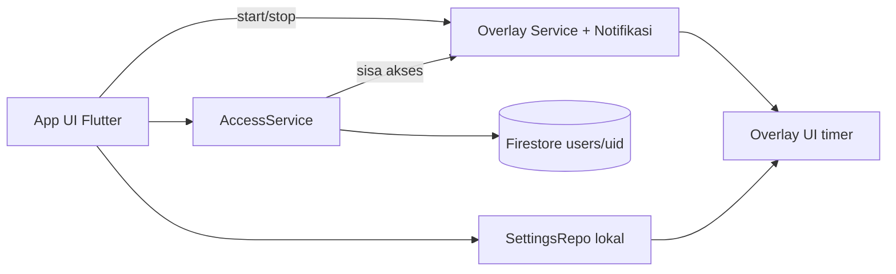

# TECH: Stack, Arsitektur, Data

## 1. Stack
| Lapisan | Pilihan | Alasan |
|---|---|---|
| App | Flutter (stable) + Dart | Sesuai keputusan; satu basis kode |
| State | Riverpod | Ringan, mudah diuji |
| Auth | Firebase Auth + `google_sign_in` | Login Google |
| Database | Cloud Firestore | Status langganan & konfigurasi app (`config/app`); paket gratis cukup |
| Overlay | `flutter_overlay_window` | Overlay Flutter di atas aplikasi lain (Android 14 butuh FGS type `specialUse`) |
| Izin | `permission_handler` | Notifikasi & status izin |
| Lokal | `shared_preferences` | Pengaturan timer (lokal) & token penanda status boot/trial lokal |
| Email & Web | `url_launcher` (mailto & browser) | Kirim bukti bayar & buka tautan unduh APK (perlu `<queries>` di manifest) |
| Monitoring | Firebase Crashlytics | Pantau crash otomatis |
| Cloud Functions | **Tidak dipakai** | Butuh paket berbayar; aktivasi manual di konsol |

minSdk 26. Semua versi package: pakai yang stabil terbaru saat T-001, lalu kunci di `pubspec.lock`.

## 2. Arsitektur

- **Overlay** berjalan di entry point terpisah (`overlayMain`) dan service foreground; membaca pengaturan dari penyimpanan lokal, tidak mengakses Firestore.
- **Pengaturan timer** disimpan lokal saja (hemat kuota, overlay jalan offline).
- **Aktivasi langganan** manual: developer mengubah `subscriptionEndsAt` di Firebase Console.

## 3. Struktur Folder
```
lib/
├── main.dart                 # entry app
├── overlay_main.dart         # entry overlay
├── core/                     # tema (tokens), konstanta, util waktu
├── features/
│   ├── auth/                 # login Google
│   ├── onboarding/
│   ├── home/                 # beranda + pengaturan overlay
│   ├── overlay/              # UI & logika timer overlay, service control
│   ├── subscription/         # halaman berlangganan, AccessService
│   └── settings/
└── data/                     # repo Firestore & lokal
assets/ (fonts, qris.png, ilustrasi)
firestore.rules
```
Aturan: `features/*` tidak saling impor langsung, lewat `data/` atau `core/`.

## 4. Data Model
Koleksi `users/{uid}`:
| Field | Tipe | Keterangan |
|---|---|---|
| email, displayName | string | dari akun Google |
| createdAt | timestamp | server time, diisi saat dibuat |
| trialStartedAt | timestamp / null | diisi sekali, server time |
| subscriptionEndsAt | timestamp / null | **hanya developer** (Console) |
| lastSeenAt | timestamp | server time, dipakai untuk mengetahui "sekarang" |
| deleteRequestedAt | timestamp / null | permintaan hapus akun (diproses manual) |

Pengaturan timer (lokal, JSON di SharedPreferences): `count, format, orientation, scale, durations[5], position`.

## 5. Logika Akses (anti manipulasi jam)
1. Saat app dibuka / tarik-segarkan: tulis `lastSeenAt = serverTimestamp()`, baca kembali (pastikan `snapshot.metadata.hasPendingWrites == false` untuk menjamin waktu server asli dan bukan estimasi latency lokal) → itu **waktu server sekarang**.
2. Hitung status (BARU/TRIAL/BERLANGGANAN/HABIS) dari waktu server tersebut.
3. Simpan di cache lokal: `sisaAksesMs` + `elapsedRealtime` + pengenal sesi boot (`bootCount`). Selama overlay aktif, service menghitung sisa akses dengan jam monotonik dan **menghentikan overlay saat habis**, sehingga mengubah jam perangkat tidak berpengaruh.
4. Offline: pakai cache selama `sisaAksesMs` belum habis (dihitung monotonik). Jika terdeteksi reboot perangkat tanpa koneksi (nilai `elapsedRealtime` tidak valid/berubah sesi), wajib online sekali untuk verifikasi ulang server time.
5. Memulai trial (Anti-Bypass): Status BARU **tidak boleh** langsung menjalankan overlay. Ketuk tombol Aktifkan pertama kali wajib berhasil menulis `trialStartedAt = serverTimestamp()` ke Firestore secara atomik; setelah dokumen terverifikasi berubah menjadi status TRIAL, overlay service baru diluncurkan.

## 6. Firestore Rules (draf, WAJIB diuji di emulator)
```
rules_version = '2';
service cloud.firestore {
  match /databases/{db}/documents {
    match /users/{uid} {
      allow read: if request.auth != null && request.auth.uid == uid;

      allow create: if request.auth != null && request.auth.uid == uid
        && request.resource.data.keys().hasOnly(
             ['email','displayName','createdAt','trialStartedAt',
              'subscriptionEndsAt','lastSeenAt','deleteRequestedAt'])
        && request.resource.data.createdAt == request.time
        && request.resource.data.trialStartedAt == null
        && request.resource.data.subscriptionEndsAt == null;

      allow update: if request.auth != null && request.auth.uid == uid
        && request.resource.data.diff(resource.data).affectedKeys()
             .hasOnly(['trialStartedAt','lastSeenAt','deleteRequestedAt'])
        && (!('lastSeenAt' in request.resource.data.diff(resource.data).affectedKeys())
             || request.resource.data.lastSeenAt == request.time)
        && (!('trialStartedAt' in request.resource.data.diff(resource.data).affectedKeys())
             || (resource.data.trialStartedAt == null
                 && request.resource.data.trialStartedAt == request.time))
        && (!('deleteRequestedAt' in request.resource.data.diff(resource.data).affectedKeys())
             || request.resource.data.deleteRequestedAt == request.time
             || request.resource.data.deleteRequestedAt == null);

      allow delete: if false;   // cegah reset trial lewat hapus dokumen
    }

    match /config/app {
      allow read: if true;      // dapat dibaca sebelum login (misal Splash untuk cek force update)
      allow write: if false;    // hanya developer lewat Console
    }
  }
}
```
Pengguna **tidak bisa** mengubah `subscriptionEndsAt`. Hanya developer (Console/Admin) yang bisa.

## 7. Prosedur Aktivasi Manual (developer)
Terima email bukti → cocokkan nominal Rp10.000 & UID → di Console buka `users/{uid}` → isi `subscriptionEndsAt` = max(sekarang, nilai lama) + 30 hari → balas email konfirmasi.

## 8. Build & Rilis (APK langsung)
- `flutter build apk --release` (satu APK universal agar mudah dibagikan); tanda tangan dengan keystore sendiri.
- **Package name dan keystore bersifat permanen** (terikat registrasi developer); daftarkan di Android Developer Console (T-017).
- Distribusi: unggah APK ke Google Drive (tautan publik), catat SHA-256, lalu perbarui `config/app` (`latestVersionCode`, `downloadUrl`).
- Firebase: daftarkan SHA-1 & SHA-256 (debug & release) untuk Google Sign-In. App Check ditunda di MVP (perlu evaluasi untuk APK di luar Play).
- Lingkungan: `dev` dan `prod` sebagai dua proyek Firebase terpisah.

## 9. Pengujian
Unit test: logika status akses & format waktu. Emulator test: Firestore rules (tolak ubah `subscriptionEndsAt`, tolak trial dua kali). Manual: overlay di game nyata di ≥ 3 merek HP, mode pesawat, ubah jam perangkat, matikan paksa app.

## 10. Estimasi Biaya
Firebase Spark: Rp0 untuk skala awal. Biaya lain: pendaftaran Android Developer Console (akun penuh berbayar sekali, cek biaya terkini di situs resmi) dan email/domain developer bila diperlukan.
